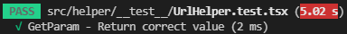
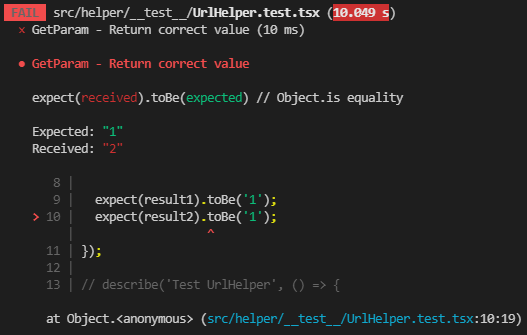
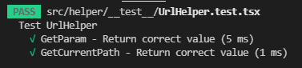

## describe and it on jest


## it(name, fn, timeout)
Also under the alias: `test(name, fn, timeout)`
All you need in a test file is the test method which runs a test.

For example, let's say there's a function GetParam() to get value params. Your whole test could be:

```ts
it('GetParam - Return correct value', () => {
    const urlString = 'https://www.domain.com/path1?val1=1&val2=2';

    const result1 = getParam({ urlString, paramName: 'val1' });
    const result2 = getParam({ urlString, paramName: 'val2' });

    expect(result1).toBe('1');
    expect(result2).toBe('2');
  });
```

Result: 



when incorrect result will be:



## describe(name, fn) 
creates a block that groups together several related tests. For example, if you have a UrlHelper for help handle data url, you could test it with:

```ts
import { getCurrentPath, getParam } from '../UrlHelper';

describe('Test UrlHelper', () => {
  it('GetParam - Return correct value', () => {
    const urlString = 'https://www.domain.com/path1?val1=1&val2=2';

    const result1 = getParam({ urlString, paramName: 'val1' });
    const result2 = getParam({ urlString, paramName: 'val2' });

    expect(result1).toBe('1');
    expect(result2).toBe('2');
  });

  it('GetCurrentPath - Return correct value', () => {
    const currentPath = 'path1';
    const url = `https://www.domain.com/${currentPath}`;

    const path = getCurrentPath(url);
    expect(path).toBe(currentPath);
  });
});
```

Result: 



## Test component

## findBy...
Returns a Promise which resolves when an element is found which matches the given query. The promise is rejected if no element is found or if more than one element is found after a default timeout of 1000ms. If you need to find more than one element, use **findAllBy**

example: 

```ts
import React from 'react';
import { screen, render } from '@testing-library/react';
import Button from '../Button';

describe('Button Component', () => {
  it('Render button', async () => {
    render((
      <Button title="button" />
    ));

    await screen.findByTestId('button');
  });
});
```

## getBy...
Returns the matching node for a query, and throw a descriptive error if no elements match or if more than one match is found (use **getAllBy** instead if more than one element is expected).

example: 

```ts
import React from 'react';
import { screen, render } from '@testing-library/react';
import Button from '../Button';

describe('Button Component', () => {
  it('Render button', async () => {
    render((
      <Button title="button submit" />
    ));

    screen.getByText('button submit');
  });
});
```

## queryBy...
Returns the matching node for a query, and return null if no elements match. This is useful for asserting an element that is not present. Throws an error if more than one match is found (use **queryAllBy** instead if this is OK).

example: 

```ts
import React from 'react';
import { screen, render } from '@testing-library/react';
import Button from '../Button';

describe('Button Component', () => {
  it('Render button', async () => {
    render((
      <Button title="button submit" />
    ));

    screen.queryByText('button submit');
  });
});
```

## UserEvent

## click component

example:

```ts
import React from 'react';
import { screen, render } from '@testing-library/react';
import userEvent from '@testing-library/user-event';
import Button from '../Button';

describe('Button Component', () => {

  it('Click button', async () => {
    let clicked = false;
    const onClick = () => {
      clicked = true;
    };

    render((
      <Button
        onClick={onClick}
        title="button"
      />
    ));

    userEvent.click(screen.getByTestId('button'));

    expect(true).toBe(clicked);
  });
});
```

## typing component

example:

```ts
import React from 'react';
import { screen, render } from '@testing-library/react';
import userEvent from '@testing-library/user-event';
import Input from '../Input';

describe('Input Component', () => {
  it('Type Input', async () => {
    let value = '';
    const onChange = () => {
      value = 'abc';
    };

    render((
      <Input
        onChange={onChange}
        value={value}
      />
    ));

    userEvent.type(screen.getByTestId('input'), 'abc');

    expect('abc').toBe(value);
  });
});
```


## test redux
example:

```ts
import React from 'react';
import { render, screen } from '@testing-library/react';
import { applyMiddleware, bindActionCreators, createStore } from 'redux';
import { Provider } from 'react-redux';
import thunk from 'redux-thunk';
import rootStore from '../stores/index';
import App from '../App';
import appStateActionImp from '../stores/app/appStateAction';

const store = createStore(rootStore, applyMiddleware(thunk));
const appStateAction = bindActionCreators(appStateActionImp, store.dispatch);

describe('App Test', () => {
  it('Test Sidebar Reagent', async () => {
    render((
      <Provider store={store}>
        <App />
      </Provider>
    ));

    expect(screen.queryByTestId('button')).not.toBeInTheDocument();
    appStateAction.editPropertyStateByKey('isShowButton', true);
    expect(screen.queryByTestId('button')).toBeInTheDocument();
  });
});
```
